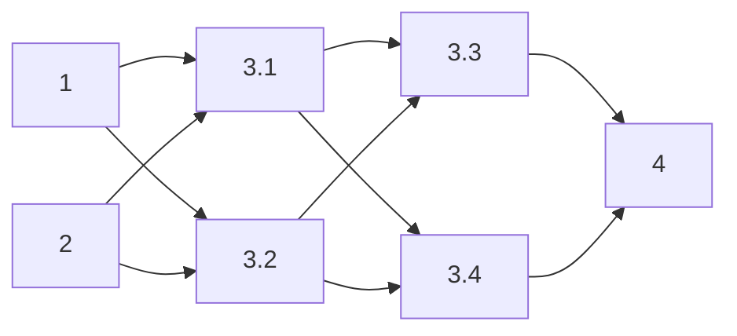

# Implementation Plan

## Overview

Fix the interview kit page's unreadable styling by defining missing CSS variables (`--color-border`, `--color-primary`, `--color-primary-hover`) in `tokens.css` and replacing all hardcoded light-theme hex colors in `resources.css` with dark-theme-compatible values from the existing glassmorphism design system.

## Task Dependency Graph

## Tasks

- [x] 1. Write bug condition exploration test
  - **Property 1: Bug Condition** - Light-Theme Colors on Dark Background
  - **CRITICAL**: This test MUST FAIL on unfixed code - failure confirms the bug exists
  - **DO NOT attempt to fix the test or the code when it fails**
  - **NOTE**: This test encodes the expected behavior - it will validate the fix when it passes after implementation
  - **GOAL**: Surface counterexamples that demonstrate undefined variables and hardcoded light colors cause readability failures
  - **Scoped PBT Approach**: Scope the property to elements with hardcoded hex backgrounds (`#f8fafc`, `#f1f5f9`, `#e2e8f0`) and elements referencing undefined variables (`--color-border`, `--color-primary`, `--color-primary-hover`)
  - Create test file `tests/property/interview-kit-dark-theme.test.js` using Vitest + fast-check + JSDOM
  - Load `resources.css` and `tokens.css` into a JSDOM environment with the interview kit HTML
  - Property: for all elements in `.resources` where `isBugCondition(cssRule)` is true (references undefined var OR uses hardcoded light hex), assert that computed background luminance is < 0.3 (dark) and text contrast ratio >= 4.5:1
  - Specifically test: blockquote bg (`#f8fafc`), inline code bg (`#f1f5f9`), pre bg (`#f1f5f9`), thead bg (`#f1f5f9`), even row bg (`#f8fafc`), hover row bg (`#f1f5f9`), group header bg (`#e2e8f0`)
  - Verify `--color-border` resolves to a visible value (not transparent/initial)
  - Verify `--color-primary` resolves to an accent color (not browser default blue)
  - Run test on UNFIXED code
  - **EXPECTED OUTCOME**: Test FAILS (this is correct - it proves the bug exists)
  - Document counterexamples found: e.g., "blockquote has luminance 0.97 (nearly white) against dark page bg hsl(240, 15%, 6%)"
  - Mark task complete when test is written, run, and failure is documented
  - _Requirements: 1.1, 1.2, 1.3, 1.4, 1.5, 1.6, 1.7, 1.8, 1.9_

- [x] 2. Write preservation property tests (BEFORE implementing fix)
  - **Property 2: Preservation** - Layout and Structure Unchanged
  - **IMPORTANT**: Follow observation-first methodology
  - Create test file `tests/property/interview-kit-preservation.test.js` using Vitest + fast-check + JSDOM
  - Load current UNFIXED stylesheets and interview kit HTML into JSDOM
  - Observe on UNFIXED code: `.resources` container max-width, padding, margins, font-family, line-height
  - Observe on UNFIXED code: h2/h3/h4 scroll-margin-top values remain `calc(var(--header-height) + 1rem)`
  - Observe on UNFIXED code: responsive font-size values at 768px breakpoint
  - Observe on UNFIXED code: list padding-left, spacing tokens, TOC structure
  - Write property-based test: for all elements NOT matching the bug condition (no undefined vars, no hardcoded light colors), computed layout properties (padding, margin, font-size, font-family, max-width, line-height) are preserved exactly
  - Use fast-check to generate random viewport widths (320px–1920px) and verify spacing/layout tokens remain consistent
  - Verify `.resources__table-wrapper` overflow-x behavior is unchanged
  - Verify `--header-height`, `--max-width`, and spacing tokens (`--space-xs` through `--space-2xl`) are unaffected
  - Run tests on UNFIXED code
  - **EXPECTED OUTCOME**: Tests PASS (this confirms baseline behavior to preserve)
  - Mark task complete when tests are written, run, and passing on unfixed code
  - _Requirements: 3.1, 3.2, 3.3, 3.4, 3.5, 3.6_

- [x] 3. Fix for interview kit page unreadable due to light-theme colors on dark background

  - [x] 3.1 Define missing CSS variables in tokens.css
    - Add `--color-border: rgba(255, 255, 255, 0.12)` after the Text section in `:root`
    - Add `--color-primary: var(--accent-primary)` to map to existing violet accent
    - Add `--color-primary-hover: hsl(265, 90%, 75%)` for hover state (10% lighter than accent-primary)
    - _Bug_Condition: isBugCondition(cssRule) where cssRule.value REFERENCES ['--color-border', '--color-primary', '--color-primary-hover'] AND variable NOT DEFINED in :root_
    - _Expected_Behavior: Variables resolve to dark-theme-compatible values — border is visible subtle white, primary matches neon accent, hover is brighter variant_
    - _Preservation: No existing variables are modified; only new definitions are added_
    - _Requirements: 2.1, 2.2_

  - [x] 3.2 Replace hardcoded light backgrounds in resources.css
    - Replace blockquote `background-color: #f8fafc` → `var(--glass-bg)` and add `border-radius: 6px`
    - Replace inline code `background-color: #f1f5f9` → `rgba(255, 255, 255, 0.08)`
    - Replace pre `background-color: #f1f5f9` → `var(--color-bg-elevated)` and add `border: 1px solid var(--color-border)`
    - Replace thead `background-color: #f1f5f9` → `var(--color-bg-elevated)`
    - Replace even row `background-color: #f8fafc` → `rgba(255, 255, 255, 0.02)`
    - Replace hover row `background-color: #f1f5f9` → `var(--glass-bg-hover)`
    - Replace group header `background-color: #e2e8f0` → `rgba(255, 255, 255, 0.06)`
    - _Bug_Condition: isBugCondition(cssRule) where cssRule.value IN ['#f8fafc', '#f1f5f9', '#e2e8f0']_
    - _Expected_Behavior: All backgrounds are dark (luminance < 0.3), text maintains contrast ratio >= 4.5:1_
    - _Preservation: Only background-color values are changed; padding, margin, font-size, border-radius (except blockquote addition), and all other properties remain unchanged_
    - _Requirements: 2.3, 2.4, 2.5, 2.6, 2.7, 2.8, 2.9_

  - [x] 3.3 Verify bug condition exploration test now passes
    - **Property 1: Expected Behavior** - Light-Theme Colors on Dark Background
    - **IMPORTANT**: Re-run the SAME test from task 1 - do NOT write a new test
    - The test from task 1 encodes the expected behavior (dark backgrounds, visible borders, accent-colored links)
    - When this test passes, it confirms all previously-undefined variables resolve correctly and all hardcoded colors are replaced with dark-theme-compatible values
    - Run bug condition exploration test from step 1: `npx vitest run tests/property/interview-kit-dark-theme.test.js`
    - **EXPECTED OUTCOME**: Test PASSES (confirms bug is fixed)
    - _Requirements: 2.1, 2.2, 2.3, 2.4, 2.5, 2.6, 2.7, 2.8, 2.9_

  - [x] 3.4 Verify preservation tests still pass
    - **Property 2: Preservation** - Layout and Structure Unchanged
    - **IMPORTANT**: Re-run the SAME tests from task 2 - do NOT write new tests
    - Run preservation property tests from step 2: `npx vitest run tests/property/interview-kit-preservation.test.js`
    - **EXPECTED OUTCOME**: Tests PASS (confirms no regressions)
    - Confirm layout, spacing, typography, scroll offsets, responsive behavior, and table overflow are all unchanged
    - _Requirements: 3.1, 3.2, 3.3, 3.4, 3.5, 3.6_

- [x] 4. Checkpoint - Ensure all tests pass
  - Run full test suite: `npx vitest run`
  - Run E2E tests if applicable: `npx playwright test`
  - Verify no regressions in existing unit tests (breakpoints, dom-content, lerp, reduced-motion)
  - Verify the interview kit page renders correctly with dark backgrounds throughout
  - Ensure all tests pass, ask the user if questions arise

## Notes

- Testing uses Vitest + fast-check (property-based testing) + JSDOM for computed style validation
- Playwright E2E tests available for full page visual verification
- All CSS changes are scoped to `tokens.css` (new variable definitions) and `resources.css` (background color replacements)
- No JavaScript or HTML changes required for this fix
