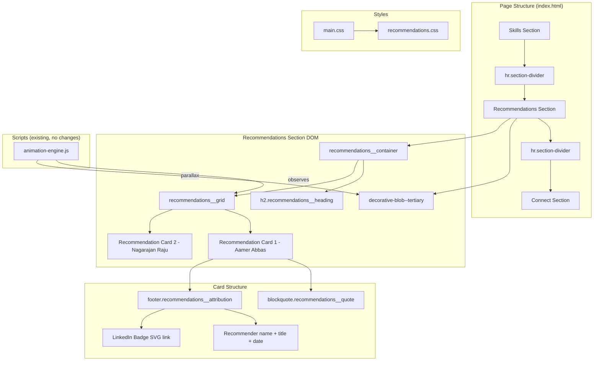

# Design Document: LinkedIn Recommendations Section

## Overview

The LinkedIn Recommendations section is a premium, static HTML component that displays professional endorsements from former Amazon managers. It slots between the existing Skills and Connect sections in the DOM, using the site's established glassmorphism design system, scroll-triggered animations, and responsive layout patterns.

The section contains exactly two recommendation cards — one from Aamer Abbas and one from Nagarajan Raju — rendered as semantic blockquotes with attribution footers, LinkedIn profile badges, and a decorative parallax blob. No additional JavaScript files, network requests, or build steps are required.

### Key Design Decisions

1. **New stylesheet `recommendations.css`** — follows the existing pattern of one CSS file per section (highlights.css, skills.css, links.css), imported via main.css
2. **BEM naming convention** — `recommendations__*` class pattern, consistent with other sections
3. **Reuse `glass-card` utility** — NOT used directly; instead, the glassmorphism is applied inline in the component CSS (matching the highlights pattern which also doesn't use the utility class, giving finer control over hover effects and neon glow)
4. **`data-section-accent="tertiary"`** — the recommendations section takes the tertiary accent, which means the Connect section below must shift to a different accent (or the recommendations section can share; based on requirements, recommendations gets tertiary)
5. **Static content** — all recommendation text is hardcoded in HTML, no JavaScript data fetching

## Architecture



## Components and Interfaces

### HTML Structure

The section is inserted into `index.html` between the Skills section's trailing `<hr>` and the Connect section:

```html
<hr class="section-divider" aria-hidden="true">
<section id="recommendations" class="recommendations" aria-labelledby="recommendations-heading" data-section-accent="tertiary">
  <div class="decorative-blob decorative-blob--tertiary" data-parallax="0.25" aria-hidden="true"></div>
  <div class="recommendations__container" data-animate-stagger="100">
    <h2 id="recommendations-heading" class="recommendations__heading">Recommendations</h2>
    <div class="recommendations__grid">
      <!-- Card 1: Aamer Abbas -->
      <article class="recommendations__card" data-animate="fade-up">
        <blockquote class="recommendations__quote">
          <p>"Noor was part of my team for about a year. I was impressed with his ability to learn quickly and deliver under tight deadlines. He always came across as an organized professional and I could always rely on him to give a clear picture of his progress on a weekly basis. I'd happily recommend him as a motivated software engineer."</p>
        </blockquote>
        <footer class="recommendations__attribution">
          <div class="recommendations__recommender">
            <span class="recommendations__name">Aamer Abbas</span>
            <span class="recommendations__title">Software Engineering Management</span>
            <span class="recommendations__relationship">Former Manager at Amazon</span>
            <span class="recommendations__date">December 2021</span>
          </div>
          <a href="https://www.linkedin.com/in/abbasaamer/" target="_blank" rel="noopener" aria-label="View Aamer Abbas's LinkedIn profile" class="recommendations__linkedin-badge">
            <!-- LinkedIn SVG icon -->
          </a>
        </footer>
      </article>
      <!-- Card 2: Nagarajan Raju -->
      <article class="recommendations__card" data-animate="fade-up">
        <blockquote class="recommendations__quote">
          <p>"Noor is a rising star..."</p>
        </blockquote>
        <footer class="recommendations__attribution">
          <div class="recommendations__recommender">
            <span class="recommendations__name">Nagarajan Raju</span>
            <span class="recommendations__title">Engineering Leader at Amazon | Building AI Solutions | Bar Raiser | ex-Microsoft &amp; Oracle</span>
            <span class="recommendations__relationship">Former Manager at Amazon</span>
            <span class="recommendations__date">November 2020</span>
          </div>
          <a href="https://www.linkedin.com/in/nagarajanraju/" target="_blank" rel="noopener" aria-label="View Nagarajan Raju's LinkedIn profile" class="recommendations__linkedin-badge">
            <!-- LinkedIn SVG icon -->
          </a>
        </footer>
      </article>
    </div>
  </div>
</section>
<hr class="section-divider" aria-hidden="true">
```

### CSS Component (`src/styles/recommendations.css`)

| Selector | Purpose |
|----------|---------|
| `.recommendations` | Section container with padding, bg, relative positioning, overflow hidden |
| `.recommendations__container` | Max-width wrapper, centering |
| `.recommendations__heading` | Gradient text heading (Space Grotesk, clamp, bold) |
| `.recommendations__grid` | CSS Grid — 1col mobile, 2col at 768px+ |
| `.recommendations__card` | Glassmorphism card with backdrop-filter, border, border-radius |
| `.recommendations__card:hover` | Lift, enhanced shadow, neon glow, bg/border transitions |
| `.recommendations__quote` | Left-border accent, quote styling, Inter font, 1.6 line-height |
| `.recommendations__attribution` | Flex row with recommender info and LinkedIn badge |
| `.recommendations__name` | Bold name text |
| `.recommendations__title` | Secondary color, smaller font |
| `.recommendations__relationship` | Muted text with relationship context |
| `.recommendations__date` | Muted text with date |
| `.recommendations__linkedin-badge` | SVG icon link with hover/focus states |

### Integration Points

| System | Integration Method |
|--------|-------------------|
| Animation Engine | `data-animate="fade-up"` on cards, `data-animate-stagger="100"` on container |
| Parallax | `data-parallax="0.25"` on decorative blob |
| Scroll Spy | `data-section-accent="tertiary"` on section element |
| CSS Architecture | `@import './recommendations.css'` added to main.css between skills and highlights imports |
| Section Dividers | `<hr class="section-divider" aria-hidden="true">` before and after section |

## Data Models

This feature uses no dynamic data. All content is static HTML. The two recommendation entries are:

| Field | Card 1 | Card 2 |
|-------|--------|--------|
| Name | Aamer Abbas | Nagarajan Raju |
| LinkedIn URL | https://www.linkedin.com/in/abbasaamer/ | https://www.linkedin.com/in/nagarajanraju/ |
| Title | Software Engineering Management | Engineering Leader at Amazon \| Building AI Solutions \| Bar Raiser \| ex-Microsoft & Oracle |
| Relationship | Former Manager at Amazon | Former Manager at Amazon |
| Date | December 2021 | November 2020 |
| Quote | Full text from noor-data.md | Full text from noor-data.md |

## Correctness Properties

*A property is a characteristic or behavior that should hold true across all valid executions of a system — essentially, a formal statement about what the system should do. Properties serve as the bridge between human-readable specifications and machine-verifiable correctness guarantees.*

This feature is a static HTML/CSS rendering component. Traditional property-based testing with randomized inputs is not applicable because there are no pure functions or data transformations. However, the following structural invariants can be verified as DOM correctness properties:

### Property 1: Recommendation card structural completeness

*For any* recommendation card rendered in the section, the card SHALL contain a `blockquote` element with non-empty text content, a `footer` element with a recommender name, title, relationship, date, and a LinkedIn badge anchor with a valid `href`, `target="_blank"`, `rel="noopener"`, and a non-empty `aria-label`.

**Validates: Requirements 2.1, 2.2, 2.3, 3.1, 3.2, 3.3, 3.4, 7.2, 7.3**

### Property 2: Responsive layout invariant

*For any* viewport width, the recommendations grid SHALL display cards in a single-column layout when width is below 768px, and in a two-column layout when width is 768px or above — with no intermediate or broken states.

**Validates: Requirements 2.6, 2.7, 4.1, 4.2**

### Property 3: Accessibility attributes completeness

*For any* rendered state of the recommendations section, the section element SHALL have `aria-labelledby` referencing a valid heading `id`, all decorative elements SHALL have `aria-hidden="true"`, and all interactive elements (LinkedIn badges) SHALL be keyboard-focusable with visible focus indicators.

**Validates: Requirements 7.1, 7.3, 7.5, 7.6**

## Error Handling

Since this is a static HTML/CSS component with no dynamic behavior:

1. **Backdrop-filter unsupported** — CSS `@supports not (backdrop-filter: blur(1px))` fallback applies `background: var(--color-bg-elevated)` as a solid opaque background
2. **JavaScript disabled** — Without `html.js-loaded`, the CSS rule hiding `[data-animate]` elements never applies, so cards remain visible with no animation (progressive enhancement)
3. **Reduced motion** — Existing CSS media query `@media (prefers-reduced-motion: reduce)` ensures no entrance animations fire; elements display at full opacity immediately
4. **SVG rendering** — LinkedIn icon is inline SVG (no external request); if SVG is unsupported, the `aria-label` on the anchor provides the link text
5. **Long text overflow** — Quote text uses `overflow-wrap: break-word` to prevent overflow on narrow viewports

## Testing Strategy

### Approach

This feature is a **static UI rendering component** (HTML + CSS + existing JS hooks). There are no pure functions, no data transformations, no parsers, and no algorithmic logic. Property-based testing is **not applicable** for this feature.

**Why PBT does not apply:**
- All content is hardcoded HTML — no input space to generate
- The CSS is declarative styling — no function to test properties against
- The JavaScript integration uses the existing animation engine with no new code
- Testing correctness here means verifying DOM structure, visual layout, and accessibility — all of which are best served by example-based integration/e2e tests

### Recommended Testing Approach

**E2E / Integration Tests (Playwright):**
1. **DOM structure** — Verify section exists with correct id, aria-labelledby, heading text, and two blockquote cards
2. **Responsive layout** — At 320px viewport, cards stack; at 768px+, cards display side-by-side (verify computed grid columns)
3. **LinkedIn links** — Verify both badge links have correct href, target="_blank", rel="noopener", and aria-label
4. **Accessibility** — axe-core audit passes on the recommendations section (color contrast, aria attributes, semantic HTML)
5. **Animation attributes** — Verify `data-animate="fade-up"` is present on cards and `data-animate-stagger="100"` on container
6. **Section placement** — Verify recommendations section appears after skills section and before connect section in DOM order
7. **Decorative blob** — Verify blob element has `aria-hidden="true"` and `data-parallax` attribute

**Visual Regression (optional):**
- Screenshot comparison at 375px and 1280px viewports to catch unintended style regressions

**Unit Tests:**
- None needed — no new JavaScript modules are introduced
