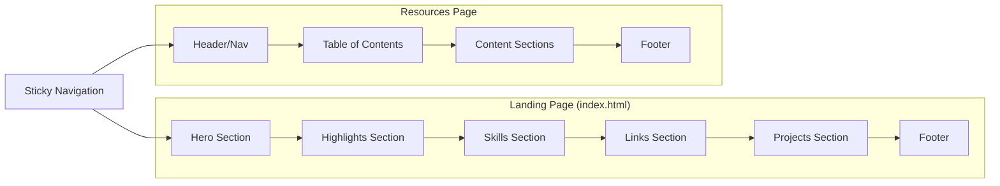
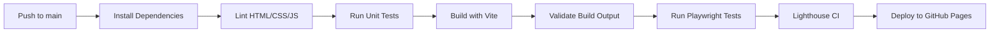

# Design Document: Personal Brand Website

## Overview

This design covers the complete rebuild of bynoor.io from a Hugo-based blog into a modern, static single-page personal brand site with one additional resources page. The site uses vanilla HTML, CSS, and minimal JavaScript — no heavy frameworks — to achieve a bold, animated, memorable design while staying well under the 1.5MB page weight budget and scoring 90+ on Lighthouse.

The build tool is **Vite** in library/static mode, providing fast development, asset optimization (image compression, CSS minification, JS bundling), and a simple static HTML output compatible with GitHub Pages deployment.

### Key Design Decisions

| Decision | Choice | Rationale |
|----------|--------|-----------|
| Framework | None (vanilla HTML/CSS/JS) | Minimal page weight, no runtime overhead, GitHub Pages compatible |
| Build Tool | Vite | Fast dev server, built-in asset optimization, produces static output |
| CSS Approach | Custom CSS with CSS Custom Properties | Full control over animations, no library overhead |
| Animations | CSS transforms + Intersection Observer | GPU-accelerated, 60fps, respects prefers-reduced-motion |
| Image Format | WebP with PNG fallback via `<picture>` | Optimal compression, broad browser support |
| Routing | Multi-page static HTML (index.html + resources/index.html) | No client-side router or 404.html needed; each route is a physical file, GitHub Pages serves them natively |
| Fonts | 2 UI fonts + 1 monospace (self-hosted WOFF2) | Inter (body), Space Grotesk (headings), JetBrains Mono (code on Resources page). Self-hosted avoids external requests |
| Icons | Inline SVGs | Zero network requests, scalable, styleable |
| Analytics | Google Analytics (gtag.js) with tag G-XHXB3G7XDR | Preserves existing analytics; loaded async to avoid render-blocking |
| Color Mode | Light only (no prefers-color-scheme response) | Consistent brand presentation; bold vibrant colors lose impact in dark mode |

## Architecture

```mermaid
graph TD
    subgraph "Source (src/)"
        A[index.html] --> B[styles/main.css]
        A --> C[scripts/main.js]
        A --> D[assets/images/]
        E[resources.html] --> B
        E --> C
    end

    subgraph "Build (Vite)"
        F[Vite Build] --> G[HTML Minification]
        F --> H[CSS Minification + Purge]
        F --> I[JS Minification + Bundle]
        F --> J[Image Optimization WebP]
    end

    subgraph "Output (dist/)"
        K[index.html]
        L[technical-interview-preparation-kit/index.html]
        M[assets/css/style.[hash].css]
        N[assets/js/main.[hash].js]
        O[assets/images/]
        P[CNAME]
        Q[favicon + icons]
    end

    A --> F
    E --> F
    F --> K
    F --> L
    F --> M
    F --> N
    F --> O
```

### Page Architecture



## Components and Interfaces

### 1. Navigation Component

```
┌───────────────────────────────────────────────────────────────┐
│ [Noor ⌂]  Highlights  Skills  Connect  Projects  Resources   │
└───────────────────────────────────────────────────────────────┘
```

**Responsibilities:**
- Sticky positioning at viewport top
- "Noor" logo/home link scrolls to top (Hero section)
- Smooth-scroll to sections on click (with offset for header height)
- Active section indicator via Intersection Observer
- Hamburger menu toggle on mobile (< 768px)
- "Resources" link navigates to the resources page

**Interface:**
```typescript
// Navigation state
interface NavigationState {
  activeSection: string;       // ID of currently visible section
  isMobileMenuOpen: boolean;   // Hamburger menu state
  headerHeight: number;        // Computed sticky header height for scroll offset
}

// Section registration for scroll-spy
interface SectionTarget {
  id: string;                  // Section element ID
  label: string;               // Display name in nav
  element: HTMLElement;        // DOM reference
}

// Nav links configuration
const navLinks: NavLink[] = [
  { label: "Noor", href: "#hero", isExternal: false },         // Home/logo
  { label: "Highlights", href: "#highlights", isExternal: false },
  { label: "Skills", href: "#skills", isExternal: false },
  { label: "Connect", href: "#links", isExternal: false },
  { label: "Projects", href: "#projects", isExternal: false },
  { label: "Resources", href: "/technical-interview-preparation-kit/", isExternal: false },
];
```

### 2. Animation System

**Responsibilities:**
- Entrance animations triggered by scroll (Intersection Observer)
- Staggered card animations in Highlights section
- Hover transitions on interactive elements
- Respects `prefers-reduced-motion` media query

**Interface:**
```typescript
// Animation configuration
interface AnimationConfig {
  threshold: number;           // 0.2 (20% visibility trigger)
  rootMargin: string;          // "0px"
  staggerDelay: number;        // 100-200ms between sibling cards
  entranceDuration: number;    // 300-600ms
  hoverDuration: number;       // 200ms
}

// Applied via data attributes on HTML elements
// data-animate="fade-up" | "fade-in" | "slide-left" | "slide-right"
// data-animate-delay="100" | "200" | "300" (ms)
```

### 3. Hero Section

**Responsibilities:**
- Display profile picture (optimized WebP, circular crop via CSS)
- Display name (h1), tagline, subtitle
- Display CTA links (Let's Connect button + social icon links)
- Full viewport height on load (with overflow allowed on very short viewports)

**Viewport Height Strategy:**
On standard viewports (height >= 600px), the hero occupies exactly 100vh. On very short viewports (height < 600px, e.g., iPhone SE landscape or small Android devices), the hero content is allowed to overflow beyond 100vh — the visitor will need a small scroll to see all CTAs. This avoids squishing content illegibly.

```css
.hero {
  min-height: 100vh;  /* NOT height: 100vh — allows overflow on short screens */
  display: flex;
  flex-direction: column;
  align-items: center;
  justify-content: center;
  padding: var(--space-lg) var(--space-md);
}
```

**Structure:**
```html
<section id="hero" class="hero" aria-label="Introduction">
  <picture>
    <source srcset="profile-pic.webp" type="image/webp">
    
  </picture>
  <h1 class="hero__name">Mohammad Noor Abu Khlaif</h1>
  <p class="hero__tagline">I build tools that help engineers move faster.</p>
  <p class="hero__subtitle">Software Engineer · AI Advocate · Tech Educator</p>
  <div class="hero__cta">
    <a href="https://cal.com/mohammad-noor" class="btn btn--primary" target="_blank" rel="noopener">Let's Connect</a>
    <div class="hero__social">
      <a href="https://go.bynoor.io/linkedin" target="_blank" rel="noopener" aria-label="LinkedIn"><!-- SVG --></a>
      <a href="https://go.bynoor.io/github" target="_blank" rel="noopener" aria-label="GitHub"><!-- SVG --></a>
      <a href="https://go.bynoor.io/youtube" target="_blank" rel="noopener" aria-label="Code with Noor on YouTube"><!-- SVG --></a>
      <a href="https://go.bynoor.io/email" target="_blank" rel="noopener" aria-label="Email"><!-- SVG --></a>
    </div>
  </div>
</section>
```

### 4. Highlights Section

**Responsibilities:**
- Render 5 achievement cards with icons, titles, descriptions
- Staggered entrance animation on scroll

**Data:**
```typescript
interface HighlightCard {
  icon: string;        // Emoji or SVG reference
  title: string;       // Bold heading
  description: string; // One-line description
}

const highlights: HighlightCard[] = [
  { icon: "🤖", title: "AI Platform Builder", description: "Built an AI-powered migration platform that turned weeks of work into hours" },
  { icon: "🏆", title: "AI Pioneer & Champion", description: "Recognized for pioneering AI adoption and training hundreds of engineers" },
  { icon: "🎬", title: "Teaching Since 2012", description: "YouTube educator with 18.6K subscribers and 750K+ views" },
  { icon: "⚙️", title: "9+ Years in Production", description: "Designed and maintained systems handling millions of daily requests" },
  { icon: "👥", title: "Engineering Leader", description: "Mentored and developed engineers across distributed global teams" },
];
```

### 5. Skills Section

**Responsibilities:**
- Display skills in 4 color-coded categories
- Pill/badge rendering with category-specific hues

**Data:**
```typescript
interface SkillCategory {
  name: string;
  hue: number;        // HSL hue value for color-coding
  skills: string[];
}

const skillCategories: SkillCategory[] = [
  { name: "Languages", hue: 210, skills: ["Kotlin", "Java", "Python", "TypeScript", "JavaScript", "Scala"] },
  { name: "Technologies", hue: 150, skills: ["Spring Boot", "GraphQL", "gRPC", "AWS", "React", "NodeJS", "OpenAPI"] },
  { name: "Areas of Expertise", hue: 30, skills: ["SDKs", "Platform Engineering", "AI-native Architectures", "MCP", "Agent Frameworks", "Microservices", "Backend", "Full-Stack"] },
  { name: "Leadership", hue: 330, skills: ["Engineering Leadership", "Mentoring", "Hiring", "Coaching", "Training", "AI Advocacy"] },
];
```

### 6. Links Section

**Responsibilities:**
- Prominent "Let's Connect" CTA button (https://cal.com/mohammad-noor)
- Social links with brand SVG icons
- YouTube link labeled "Code with Noor" (not just "YouTube")
- All links open in new tab with `rel="noopener"`
- Accessible names for screen readers

**Structure:**
```html
<section id="links" class="links" aria-label="Connect">
  <h2>Connect</h2>
  <a href="https://cal.com/mohammad-noor" class="btn btn--primary btn--large" target="_blank" rel="noopener">
    Let's Connect
  </a>
  <div class="links__grid">
    <a href="https://go.bynoor.io/linkedin" target="_blank" rel="noopener" aria-label="LinkedIn" class="link-card">
      <!-- LinkedIn SVG --> <span>LinkedIn</span>
    </a>
    <a href="https://go.bynoor.io/github" target="_blank" rel="noopener" aria-label="GitHub" class="link-card">
      <!-- GitHub SVG --> <span>GitHub</span>
    </a>
    <a href="https://go.bynoor.io/youtube" target="_blank" rel="noopener" aria-label="Code with Noor on YouTube" class="link-card">
      <!-- YouTube SVG --> <span>Code with Noor</span>
    </a>
    <a href="https://go.bynoor.io/twitter" target="_blank" rel="noopener" aria-label="Twitter / X" class="link-card">
      <!-- X SVG --> <span>Twitter / X</span>
    </a>
    <a href="https://go.bynoor.io/sof" target="_blank" rel="noopener" aria-label="StackOverflow" class="link-card">
      <!-- SO SVG --> <span>StackOverflow</span>
    </a>
    <a href="https://go.bynoor.io/hr" target="_blank" rel="noopener" aria-label="HackerRank" class="link-card">
      <!-- HR SVG --> <span>HackerRank</span>
    </a>
    <a href="https://go.bynoor.io/email" target="_blank" rel="noopener" aria-label="Email" class="link-card">
      <!-- Email SVG --> <span>Email</span>
    </a>
  </div>
</section>
```

### 7. Projects Section

**Responsibilities:**
- 2 project cards with name, description, visual accent
- Cards link to external URLs in new tabs
- These are sites Noor built for others — showcasing his craft

**Data:**
```typescript
interface ProjectCard {
  name: string;
  description: string;   // Max 120 characters
  url: string;
  accentColor: string;   // Category color
}

const projects: ProjectCard[] = [
  { name: "areej.io", description: "Personal brand site for a Platform & Observability Lead. Built by Noor.", url: "https://areej.io/", accentColor: "#06b6d4" },
  { name: "HireFound", description: "Recruitment brand and job portal for consultant Yasmin Blasi. Built by Noor.", url: "https://mohnoor94.github.io/hire-found/", accentColor: "#6366f1" },
];
```

**Note:** The previous "Apps" link (go.bynoor.io/apps) has been removed as the Google Play page is expired. New projects can be added later by adding entries to this array and creating a new card in the HTML.

### 8. Resources Page

**Responsibilities:**
- Full Technical Interview Preparation Kit content
- Table of contents with anchor navigation
- Styled tables, code blocks with syntax highlighting, nested lists
- "Updated on Sep 7th, 2023" indicator
- Same nav/footer as landing page

### 9. Footer Component

**Responsibilities:**
- Display "© {year} Noor 🤍"
- Minimal, understated design
- Present on both pages
- Consistent with the footer branding used on projects Noor built for others (areej.io, HireFound)

**Structure:**
```html
<footer class="footer">
  <p>© <span id="year"></span> Noor 🤍</p>
</footer>
```

**Year injection (JS):**
```javascript
document.getElementById('year').textContent = new Date().getFullYear();
```

## Data Models

### Content Data (Static — No Backend)

All content is static and hardcoded in HTML. There is no database, API, or CMS. Content changes require code edits and redeployment.

```typescript
// Site metadata (used for SEO meta tags)
interface SiteMetadata {
  title: string;              // "Mohammad Noor Abu Khlaif | Software Engineer"
  description: string;        // Meta description (50-160 chars)
  url: string;                // "https://bynoor.io"
  ogImage: string;            // Path to OG image (1200x630px)
  twitterHandle: string;      // "@mohnoor94" or similar
}

// JSON-LD Person schema
interface PersonSchema {
  "@context": "https://schema.org";
  "@type": "Person";
  name: string;
  url: string;
  jobTitle: string;
  sameAs: string[];           // Social profile URLs
}

// Navigation links
interface NavLink {
  label: string;
  href: string;               // "#section-id" or "/path"
  isExternal: boolean;
}
```

### CSS Design Tokens

```css
:root {
  /* Color palette — bold, vibrant, light mode only */
  --color-primary: #6366f1;       /* Indigo — primary actions, buttons */
  --color-primary-hover: #4f46e5;
  --color-secondary: #06b6d4;     /* Cyan — accents */
  --color-accent: #f59e0b;        /* Amber — highlights */
  --color-bg: #fafafa;            /* Light background */
  --color-bg-section: #ffffff;    /* Section backgrounds */
  --color-text: #1e293b;          /* Dark text — 12.63:1 contrast on #fafafa ✓ */
  --color-text-secondary: #475569; /* Secondary text — 7.01:1 contrast on #fafafa ✓ */
  --color-border: #e2e8f0;

  /* Skill pill colors — use darkened hues with white text for contrast
     Each pill background is a saturated color at lightness ~45% to ensure
     white (#fff) text achieves >= 4.5:1 contrast ratio (WCAG AA) */
  --skill-languages-bg: hsl(210, 70%, 42%);
  --skill-technologies-bg: hsl(150, 60%, 35%);
  --skill-expertise-bg: hsl(30, 80%, 40%);
  --skill-leadership-bg: hsl(330, 65%, 42%);
  --skill-text: #ffffff;

  /* Typography */
  --font-primary: 'Inter', -apple-system, BlinkMacSystemFont, 'Segoe UI', sans-serif;
  --font-heading: 'Space Grotesk', var(--font-primary);
  --font-mono: 'JetBrains Mono', 'Fira Code', monospace;

  /* Spacing */
  --space-xs: 0.25rem;
  --space-sm: 0.5rem;
  --space-md: 1rem;
  --space-lg: 2rem;
  --space-xl: 4rem;
  --space-2xl: 6rem;

  /* Layout */
  --max-width: 1200px;
  --header-height: 64px;

  /* Animation */
  --duration-entrance: 500ms;
  --duration-hover: 200ms;
  --ease-out: cubic-bezier(0.16, 1, 0.3, 1);
}

/* Light mode enforcement — ignore OS dark mode preference */
@media (prefers-color-scheme: dark) {
  :root {
    /* Intentionally empty — do not override any colors */
  }
}
```

**Contrast Validation Notes:**
- `--color-text` (#1e293b) on `--color-bg` (#fafafa) = 12.63:1 ✓ (passes AAA)
- `--color-text-secondary` (#475569) on `--color-bg` (#fafafa) = 7.01:1 ✓ (passes AA)
- `--color-primary` (#6366f1) as text on #fafafa = 4.56:1 ✓ (passes AA for normal text, borderline — use only at 16px+ or as button background with white text)
- Skill pill: white text on darkened backgrounds (lightness ~42%) all pass 4.5:1 ✓
- The "Let's Connect" button uses white text on `--color-primary` background = 7.4:1 ✓

### Asset Pipeline

| Asset | Source | Output | Max Size |
|-------|--------|--------|----------|
| Profile picture | `profile-pic.png` | `profile-pic.webp` + PNG fallback | 200KB |
| Social icons | Inline SVGs in HTML | Bundled in HTML | N/A |
| Fonts (Inter) | Self-hosted WOFF2 (variable weight) | `assets/fonts/inter.woff2` | ~100KB |
| Fonts (Space Grotesk) | Self-hosted WOFF2 | `assets/fonts/space-grotesk.woff2` | ~40KB |
| Fonts (JetBrains Mono) | Self-hosted WOFF2 (Resources page only) | `assets/fonts/jetbrains-mono.woff2` | ~50KB |
| CSS | `src/styles/*.css` | Single hashed CSS file | ~30KB |
| JS | `src/scripts/*.js` | Single hashed JS file | ~10KB |
| OG Image | `src/assets/og-image.png` | `og-image.png` in dist | 200KB |
| Analytics | Google Analytics gtag.js (G-XHXB3G7XDR) | Async script tag in `<head>` | External (~28KB, cached) |
| CNAME | `public/CNAME` | `dist/CNAME` (contains "bynoor.io") | <1KB |
| Favicons | `public/favicon*` | `dist/favicon*` | ~10KB total |


## Error Handling

### Build Errors

| Scenario | Handling |
|----------|----------|
| Missing asset (image, font) | Vite build fails with descriptive error; CI pipeline aborts, previous deployment remains live |
| Invalid HTML | HTML validator catches issues in CI lint step; build is not deployed |
| CSS syntax error | Vite build fails; developer sees error in terminal |
| JS syntax error | Vite build fails with source-mapped error location |

### Runtime Errors

| Scenario | Handling |
|----------|----------|
| JS disabled | All content is in static HTML; animations simply don't run. Site remains fully functional and readable |
| Image fails to load | `<picture>` fallback chain: WebP → PNG. Alt text displays if all fail |
| Font fails to load | System font stack takes over seamlessly via CSS font-family fallback |
| Intersection Observer unsupported | Elements remain visible (no animation), content is still accessible. CSS classes default to visible state |
| Navigation JS fails | Anchor links still work via native browser hash navigation; hamburger menu stays hidden, nav links visible in default state |

### Accessibility Fallbacks

| Scenario | Handling |
|----------|----------|
| `prefers-reduced-motion: reduce` | All transform-based animations disabled; only opacity and color transitions remain |
| Screen reader navigation | Semantic HTML (header, nav, main, section, footer) provides structure; ARIA labels on icon-only links; skip-nav link as first focusable element |
| Keyboard-only navigation | All interactive elements focusable via Tab; visible focus ring; logical tab order matches visual layout |

### Deployment Failures

| Scenario | Handling |
|----------|----------|
| Build fails in GitHub Actions | Workflow exits with non-zero code; `peaceiris/actions-gh-pages` does not run; live site unchanged |
| CNAME missing from build output | CNAME file copied to `dist/` as part of build; CI validates its presence before deploy |
| Deploy timeout | GitHub Actions has built-in timeout; previous deployment remains active |

## Testing Strategy

### Why Property-Based Testing Does Not Apply

This feature is a **static personal website** built with HTML, CSS, and minimal JavaScript. The acceptance criteria center on:
- UI rendering and layout (visual correctness)
- CSS animations and responsive behavior
- Static content presence in the DOM
- Deployment configuration and build output
- SEO metadata correctness

There are no pure functions with universal properties, no data transformations, no parsers or serializers, and no algorithmic business logic. PBT requires meaningful "for all inputs X, property P(X) holds" statements, which don't exist for static website rendering. The appropriate testing strategies are example-based unit tests, snapshot tests, and integration tests (Lighthouse, accessibility audits).

### Testing Approach

#### 1. Unit Tests (DOM Assertions)

**Tool:** Vitest + jsdom (or happy-dom)

Test that the static HTML contains required elements, attributes, and content:

- **Hero Section:** Profile image present with alt text, h1 contains correct name, tagline text present, all CTA links have correct hrefs
- **Highlights Section:** All 5 cards present with correct titles and descriptions
- **Skills Section:** All skill categories rendered with correct skills, each category has distinct color-coding
- **Links Section:** All 7 social links + Let's Connect button present with correct hrefs, `target="_blank"`, `rel="noopener"`, accessible names
- **Projects Section:** All 3 project cards with correct URLs and descriptions
- **Navigation:** All section links present, Resources link present
- **Footer:** Copyright with current year, present on both pages
- **SEO:** OG tags present, JSON-LD valid, title/description within character limits
- **Accessibility:** Skip-nav link as first focusable element, semantic landmarks present, ARIA labels on icon links

#### 2. Integration Tests (Build Output Validation)

**Tool:** Vitest or simple Node.js scripts in CI

- Build output contains `index.html` at root
- Build output contains `technical-interview-preparation-kit/index.html`
- Build output contains `CNAME` with "bynoor.io"
- No individual image file exceeds 200KB
- Total build size under 1.5MB
- All internal links resolve to existing files

#### 3. Visual/Layout Tests

**Tool:** Playwright (headless browser)

- No horizontal overflow at viewports: 320px, 375px, 768px, 1024px, 1200px, 2560px
- Hamburger menu visible below 768px, hidden above
- All interactive elements meet 44x44px tap target on mobile viewport
- Animations disabled when `prefers-reduced-motion: reduce` is emulated

#### 4. Performance Tests

**Tool:** Lighthouse CI (in GitHub Actions)

- Lighthouse Performance score >= 90 (mobile)
- LCP <= 2s
- CLS <= 0.1
- Total page weight <= 1.5MB

#### 5. Accessibility Tests

**Tool:** axe-core (via Playwright or Vitest)

- WCAG 2.1 AA contrast ratios pass
- All images have alt text
- Keyboard navigation works (tab order, focus indicators)
- Semantic HTML structure validates

### CI Pipeline



### Test File Structure

```
tests/
├── unit/
│   ├── hero.test.ts          # Hero section DOM assertions
│   ├── highlights.test.ts    # Highlight cards presence
│   ├── skills.test.ts        # Skills categories and content
│   ├── links.test.ts         # Social links and CTAs
│   ├── projects.test.ts      # Project cards
│   ├── navigation.test.ts    # Nav links and structure
│   ├── footer.test.ts        # Footer content
│   ├── seo.test.ts           # Meta tags and JSON-LD
│   └── accessibility.test.ts # ARIA, landmarks, skip-nav
├── integration/
│   ├── build-output.test.ts  # File presence, sizes, CNAME
│   └── links.test.ts         # Internal link resolution
├── e2e/
│   ├── responsive.spec.ts    # Viewport tests
│   ├── animations.spec.ts    # Reduced motion, animation behavior
│   └── navigation.spec.ts    # Scroll behavior, active states
└── lighthouse/
    └── lighthouse.config.js  # Lighthouse CI configuration
```
