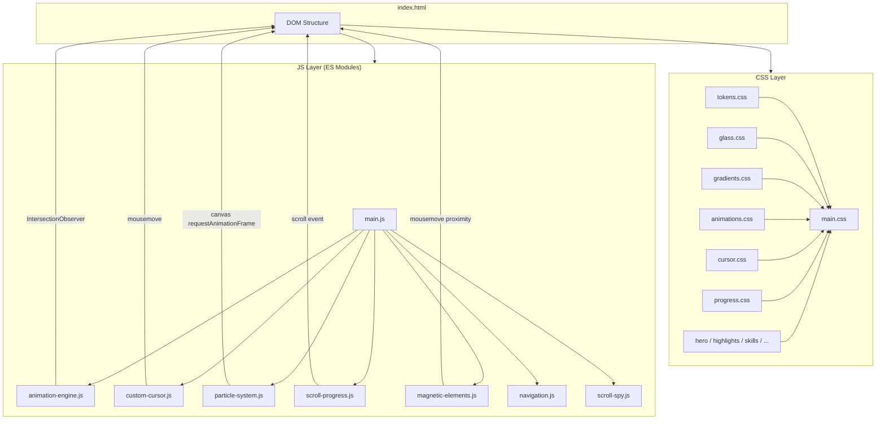
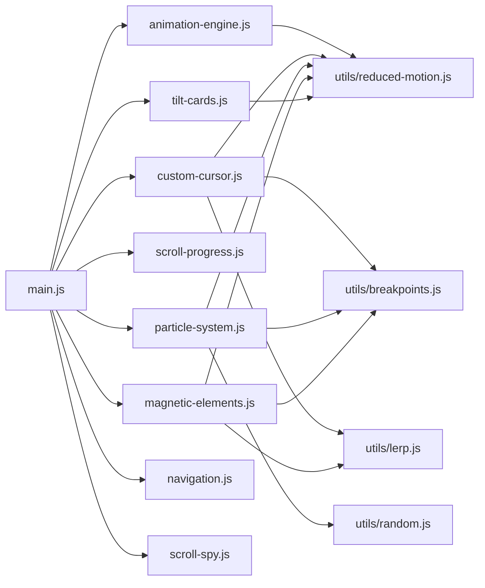

# Design Document: Website Creative Redesign

## Overview

This design transforms bynoor.io from a clean light-themed personal site into a bold, dark-mode-first experience featuring animated gradient meshes, a custom cursor system, particle effects, glassmorphism cards, and scroll-driven animations — all built with vanilla HTML, CSS, and JavaScript (ES modules) served via Vite.

The architecture prioritizes progressive enhancement: the site remains fully functional without JavaScript, and all creative enhancements layer on top. Performance stays within Lighthouse 90+ targets by offloading animation to the compositor thread (CSS transitions + transforms) and deferring non-critical scripts.

### Key Design Decisions

| Decision | Rationale |
|----------|-----------|
| Canvas-based particle system | Canvas gives per-pixel control and avoids DOM thrashing for 50 moving elements |
| CSS custom properties for theming | Already in use; extending the token system avoids a refactor |
| Single animation orchestrator module | Centralizes IntersectionObserver lifecycle and reduced-motion checks |
| Lerp-based cursor tracking | Smooth trailing without spring physics complexity; tunable via a single factor |
| CSS `@property` for gradient animation | GPU-composited hue rotation without JS frame loops |
| BEM naming preserved | Existing convention; no reason to break consistency |
| ResizeObserver for canvas | Handles viewport resizes without polling; recalculates particle bounds dynamically |
| Perspective-based 3D tilt | Pure CSS + minimal JS pointer tracking for card hover; more immersive than flat translateY |
| Section gradient dividers | Visual continuity between dark sections; avoids harsh edges |

## Architecture



### Module Dependency Graph



## Components and Interfaces

### 1. Animation Engine (`animation-engine.js`)

Replaces the existing `animations.js`. Manages all scroll-triggered entrance animations and section accent reveals.

```javascript
// Public interface
export function initAnimationEngine(): void;

// Internal
// - Creates a single IntersectionObserver (threshold: 0.2)
// - On intersection: adds .animate-visible, applies transition-delay from data-animate-delay
// - Unobserves element after first trigger (fire-once semantics)
// - If prefers-reduced-motion: skips adding .animate-hidden, all elements visible immediately
// - Stagger logic: reads data-animate-stagger on parent, auto-calculates child delays
```

**Configuration via data attributes:**
- `data-animate="fade-up|fade-in|scale-in"` — animation type
- `data-animate-delay="<ms>"` — explicit delay
- `data-animate-stagger="<ms>"` — parent-level: auto-delays children by increment

**Sections with staggered animations:**
- Highlights grid cards: 100ms stagger
- Skills categories: 150–250ms stagger
- Connect link cards: 80ms stagger
- Projects grid cards: 120ms stagger

### 2. Custom Cursor (`custom-cursor.js`)

A floating DOM element that tracks the mouse with a lerp-based trailing delay.

```javascript
// Public interface
export function initCustomCursor(): void;

// Internal state
interface CursorState {
  targetX: number;      // actual mouse X
  targetY: number;      // actual mouse Y
  currentX: number;     // rendered cursor X
  currentY: number;     // rendered cursor Y
  isVisible: boolean;
  isHovering: boolean;  // over interactive element
  lerpFactor: number;   // 0.08–0.15 (controls trailing lag)
}

// Behavior:
// - Only active when viewport >= 1024px
// - Uses requestAnimationFrame loop for smooth interpolation
// - Lerp formula: current += (target - current) * lerpFactor
// - On mouseenter/mouseleave on document: toggle visibility
// - On pointerover on 'a, button, [role="button"]': set isHovering → scale 1.5x
// - Adds .cursor-active to <html> to hide native cursor via CSS
// - Destroyed/paused when reduced-motion is active or viewport < 1024px
// - Listens for window resize: if viewport crosses below 1024px mid-session, destroys cursor and restores native
// - If viewport crosses above 1024px after being below, re-initializes cursor
// - Uses matchMedia('(min-width: 1024px)').addEventListener('change', ...) for efficient breakpoint detection
```

### 3. Particle System (`particle-system.js`)

Canvas-based floating orbs rendered in the hero section background.

```javascript
// Public interface
export function initParticleSystem(canvas: HTMLCanvasElement): void;
export function destroyParticleSystem(): void;

// Internal
interface Particle {
  x: number;
  y: number;
  radius: number;       // 2–6 (rendered at 4–12px with devicePixelRatio)
  velocityX: number;    // -0.3 to 0.3
  velocityY: number;    // -0.2 to 0.2
  opacity: number;      // 0.1–0.4
  hue: number;          // from accent palette
}

// Behavior:
// - Initializes with min(50, area/10000) particles
// - Runs requestAnimationFrame loop
// - Particles wrap around edges (toroidal space)
// - Container opacity controlled by scroll position: opacity = max(0, 1 - scrollPastHero/200)
// - On mobile (< 768px): not initialized
// - On reduced-motion: not initialized
// - Canvas has pointer-events: none
// - Pauses RAF when tab is not visible (document.hidden)
// - Uses ResizeObserver on hero section to re-dimension canvas on viewport changes
// - On resize: recalculates canvas width/height, redistributes particles within new bounds
```

**Canvas Resize Handling:**
```javascript
// ResizeObserver on the hero section container
// On resize callback:
//   - canvas.width = entry.contentRect.width * Math.min(devicePixelRatio, 2)
//   - canvas.height = entry.contentRect.height * Math.min(devicePixelRatio, 2)
//   - canvas.style.width = entry.contentRect.width + 'px'
//   - canvas.style.height = entry.contentRect.height + 'px'
//   - Clamp existing particle positions to new bounds (no respawn)
```

### 4. Scroll Progress (`scroll-progress.js`)

Fixed gradient bar at the top showing scroll percentage.

```javascript
// Public interface
export function initScrollProgress(): void;

// Internal
// - Listens to scroll event (passive: true)
// - Computes: progress = scrollTop / (scrollHeight - clientHeight)
// - Sets CSS custom property --scroll-progress on the progress element
// - The element uses: width: calc(var(--scroll-progress) * 100%)
// - Uses requestAnimationFrame to batch DOM writes
// - Gradient defined in CSS via tokens
```

### 5. Magnetic Elements (`magnetic-elements.js`)

CTA buttons that subtly pull toward the cursor when nearby.

```javascript
// Public interface
export function initMagneticElements(): void;

// Internal
// - Selects all elements with [data-magnetic] attribute
// - On mousemove (throttled via RAF):
//   - For each magnetic element, compute distance from cursor to element center
//   - If distance < 80px: translate element toward cursor
//   - Translation formula: offset = (cursorPos - centerPos) * (1 - distance/80) * maxOffset/80
//   - Maximum translation: 8px in any direction
//   - Apply via CSS transform: translate(dx, dy)
// - On mouseleave from element: animate back to translate(0,0) over 300ms
// - Disabled when reduced-motion is active
// - Disabled when viewport < 1024px
```

### 6. Utility Modules

#### `utils/reduced-motion.js`
```javascript
export function prefersReducedMotion(): boolean;
export function onMotionPreferenceChange(callback: (reduced: boolean) => void): void;
// Uses matchMedia('(prefers-reduced-motion: reduce)')
// Provides reactive listener for live changes
```

#### `utils/lerp.js`
```javascript
export function lerp(current: number, target: number, factor: number): number;
// Returns: current + (target - current) * factor
```

#### `utils/random.js`
```javascript
export function randomBetween(min: number, max: number): number;
export function randomInt(min: number, max: number): number;
```

#### `utils/breakpoints.js`
```javascript
export function onBreakpointChange(minWidth: number, callback: (matches: boolean) => void): void;
// Wraps matchMedia(`(min-width: ${minWidth}px)`).addEventListener('change', ...)
// Calls callback immediately with current match state, then on every change
// Used by cursor, particles, magnetic, and parallax to handle mid-session resizes

export function isAbove(minWidth: number): boolean;
// One-shot check: returns matchMedia result for current viewport
```

### 7. Gradient Mesh Background (CSS-only)

The hero gradient mesh uses CSS `@property` registered custom properties for GPU-composited hue animation:

```css
@property --mesh-hue-1 { syntax: '<angle>'; inherits: false; initial-value: 0deg; }
@property --mesh-hue-2 { syntax: '<angle>'; inherits: false; initial-value: 120deg; }
@property --mesh-hue-3 { syntax: '<angle>'; inherits: false; initial-value: 240deg; }

.hero__mesh {
  background: 
    radial-gradient(ellipse at 20% 50%, hsl(var(--mesh-hue-1), 80%, 50%) 0%, transparent 50%),
    radial-gradient(ellipse at 80% 20%, hsl(var(--mesh-hue-2), 75%, 45%) 0%, transparent 50%),
    radial-gradient(ellipse at 50% 80%, hsl(var(--mesh-hue-3), 85%, 55%) 0%, transparent 50%);
  animation: mesh-cycle 12s ease-in-out infinite;
}

@keyframes mesh-cycle {
  0%   { --mesh-hue-1: 260deg; --mesh-hue-2: 200deg; --mesh-hue-3: 320deg; }
  33%  { --mesh-hue-1: 280deg; --mesh-hue-2: 220deg; --mesh-hue-3: 340deg; }
  66%  { --mesh-hue-1: 240deg; --mesh-hue-2: 180deg; --mesh-hue-3: 300deg; }
  100% { --mesh-hue-1: 260deg; --mesh-hue-2: 200deg; --mesh-hue-3: 320deg; }
}
```

### 8. Scroll-Down Indicator

A chevron element at the bottom of the hero section with a looping bounce animation:

```html
<!-- Added inside the hero section, after .hero__cta-group -->
<div class="hero__scroll-indicator" aria-hidden="true">
  <svg width="24" height="24" viewBox="0 0 24 24" fill="none" stroke="currentColor" stroke-width="2">
    <path d="M7 13l5 5 5-5M7 6l5 5 5-5"/>
  </svg>
</div>
```

```css
.hero__scroll-indicator {
  position: absolute;
  bottom: var(--space-lg);
  left: 50%;
  transform: translateX(-50%);
  color: rgba(255, 255, 255, 0.7);
  animation: bounce-down 1.5s ease-in-out infinite;
}

@keyframes bounce-down {
  0%, 100% { transform: translateX(-50%) translateY(0); }
  50% { transform: translateX(-50%) translateY(8px); }
}

@media (prefers-reduced-motion: reduce) {
  .hero__scroll-indicator { animation: none; }
}
```

### 9. Section Dividers

Gradient-based transitions between sections prevent harsh visual cuts in the dark theme:

```css
.section-divider {
  height: 1px;
  background: linear-gradient(90deg, transparent, var(--accent-primary), var(--accent-secondary), transparent);
  opacity: 0.3;
  border: none;
  margin: 0;
}
```

Each section boundary in the HTML receives a `<hr class="section-divider" aria-hidden="true">` element. The gradient color matches the upcoming section's assigned accent.

### 10. Nav Logo Glow Effect

The "bynoor.io" logo in the navigation gets a subtle animated text glow:

```css
.nav__logo-noor {
  text-shadow: 0 0 8px var(--accent-primary);
  transition: text-shadow var(--duration-hover) var(--ease-out);
}

.nav__logo-noor:hover {
  text-shadow: 0 0 16px var(--accent-primary), 0 0 32px var(--accent-secondary);
}

/* When nav is in glassmorphism state (scrolled) */
.nav--scrolled .nav__logo-noor {
  text-shadow: 0 0 12px var(--accent-primary);
}
```

### 11. 3D Tilt Effect on Cards

Perspective-based tilt on hover using pointer position tracking. Applied to highlight cards, project cards, and connect link cards:

```css
.tilt-card {
  transform-style: preserve-3d;
  transition: transform var(--duration-hover) var(--ease-out);
}

.tilt-card:hover {
  /* Base transform overridden by JS with actual rotation values */
  transform: perspective(800px) rotateX(var(--tilt-x, 0deg)) rotateY(var(--tilt-y, 0deg)) translateZ(10px);
}
```

```javascript
// Integrated into animation-engine.js or as a separate lightweight handler
// On pointermove over .tilt-card elements:
//   - Calculate pointer position relative to card center
//   - Map to rotation: rotateY = (pointerX - centerX) / halfWidth * maxAngle
//   - Map to rotation: rotateX = -(pointerY - centerY) / halfHeight * maxAngle
//   - maxAngle: 5deg (subtle, not nauseating)
//   - Apply via CSS custom properties --tilt-x, --tilt-y
// On pointerleave: reset to 0deg with transition
// Disabled when reduced-motion is active (hover falls back to translateY lift)
```

### 12. Footer Redesign

The footer gets dark-theme treatment with creative elements:

```css
.footer {
  background: var(--color-bg);
  border-top: 1px solid transparent;
  border-image: linear-gradient(90deg, transparent, var(--accent-primary), var(--accent-secondary), transparent) 1;
  padding: var(--space-xl) var(--space-md);
  text-align: center;
  color: var(--color-text-secondary);
}

.footer__logo-noor {
  text-shadow: 0 0 8px var(--accent-primary);
}

.footer__beta-badge {
  background: var(--glass-bg);
  border: 1px solid var(--glass-border);
  backdrop-filter: blur(var(--glass-blur));
  padding: var(--space-xs) var(--space-md);
  border-radius: 9999px;
  font-size: 0.85rem;
  color: var(--accent-quaternary);
}
```

## Data Models

### Design Token System (CSS Custom Properties)

```css
:root {
  /* === Dark Background === */
  --color-bg: hsl(240, 15%, 6%);              /* ~6% lightness */
  --color-bg-section: hsl(240, 12%, 9%);      /* card backgrounds */
  --color-bg-elevated: hsl(240, 10%, 12%);    /* elevated surfaces */

  /* === Neon Accents (max 4, saturation 70%+) === */
  --accent-primary: hsl(265, 90%, 65%);       /* violet */
  --accent-secondary: hsl(195, 85%, 55%);     /* cyan */
  --accent-tertiary: hsl(330, 80%, 60%);      /* magenta/pink */
  --accent-quaternary: hsl(45, 90%, 60%);     /* amber/gold */

  /* === Text === */
  --color-text: hsl(0, 0%, 93%);             /* primary text */
  --color-text-secondary: hsl(0, 0%, 68%);   /* secondary text */
  --color-text-muted: hsl(0, 0%, 45%);       /* muted text */

  /* === Glassmorphism === */
  --glass-bg: rgba(255, 255, 255, 0.05);
  --glass-bg-hover: rgba(255, 255, 255, 0.10);
  --glass-border: rgba(255, 255, 255, 0.10);
  --glass-border-hover: rgba(255, 255, 255, 0.20);
  --glass-blur: 12px;

  /* === Gradients === */
  --gradient-text: linear-gradient(135deg, var(--accent-primary), var(--accent-secondary));
  --gradient-progress: linear-gradient(90deg, var(--accent-primary), var(--accent-secondary), var(--accent-tertiary));
  --gradient-hero-mesh: radial-gradient(ellipse at 20% 50%, var(--accent-primary), transparent 50%);

  /* === Spacing (unchanged) === */
  --space-xs: 0.25rem;
  --space-sm: 0.5rem;
  --space-md: 1rem;
  --space-lg: 2rem;
  --space-xl: 4rem;
  --space-2xl: 6rem;

  /* === Typography (unchanged fonts, new weights) === */
  --font-primary: 'Inter', -apple-system, BlinkMacSystemFont, 'Segoe UI', sans-serif;
  --font-heading: 'Space Grotesk', var(--font-primary);
  --font-mono: 'JetBrains Mono', 'Fira Code', monospace;
  --fw-light: 300;
  --fw-regular: 400;
  --fw-semibold: 600;
  --fw-bold: 700;

  /* === Animation === */
  --duration-entrance: 500ms;
  --duration-hover: 200ms;
  --duration-mesh: 12s;
  --ease-out: cubic-bezier(0.16, 1, 0.3, 1);
  --ease-spring: cubic-bezier(0.34, 1.56, 0.64, 1);

  /* === Layout === */
  --max-width: 1200px;
  --header-height: 64px;

  /* === Cursor === */
  --cursor-size: 20px;
  --cursor-size-hover: 40px;
  --cursor-color: var(--accent-primary);

  /* === Particles === */
  --particle-max-count: 50;
  --particle-min-size: 4px;
  --particle-max-size: 12px;

  /* === Scroll Progress === */
  --scroll-progress: 0;
}
```

### Particle State Model

```
Particle {
  x: float [0, canvasWidth]
  y: float [0, canvasHeight]
  radius: float [2, 6]  (CSS px = radius * devicePixelRatio)
  vx: float [-0.3, 0.3]
  vy: float [-0.2, 0.2]
  opacity: float [0.1, 0.4]
  hue: int (from accent palette angles: 265, 195, 330, 45)
}
```

### Cursor State Model

```
CursorState {
  targetX: float
  targetY: float
  currentX: float
  currentY: float
  isVisible: boolean
  isHovering: boolean
  lerpFactor: 0.1 (configurable 0.08–0.15)
}
```

### Magnetic Element Calculation Model

```
Input:
  cursorX, cursorY: mouse position
  centerX, centerY: element bounding box center
  threshold: 80px
  maxOffset: 8px

Output:
  dx, dy: translation in px

Formula:
  distance = sqrt((cursorX - centerX)² + (cursorY - centerY)²)
  if distance > threshold: dx = 0, dy = 0
  else:
    strength = 1 - (distance / threshold)
    dx = clamp((cursorX - centerX) * strength * (maxOffset / threshold), -maxOffset, maxOffset)
    dy = clamp((cursorY - centerY) * strength * (maxOffset / threshold), -maxOffset, maxOffset)
```

## File Structure

```
src/
├── styles/
│   ├── main.css              # Import aggregator
│   ├── reset.css             # CSS reset (existing)
│   ├── tokens.css            # Design tokens (redesigned for dark theme)
│   ├── fonts.css             # Font-face declarations (existing)
│   ├── gradients.css         # NEW: gradient utilities, mesh keyframes, @property defs
│   ├── glass.css             # NEW: glassmorphism utility classes
│   ├── cursor.css            # NEW: custom cursor styles
│   ├── progress.css          # NEW: scroll progress bar
│   ├── dividers.css          # NEW: section divider gradients
│   ├── decorative.css        # NEW: background blobs, radial glows
│   ├── animations.css        # Entrance animation classes (updated)
│   ├── hero.css              # Hero section (redesigned, includes scroll indicator)
│   ├── nav.css               # Navigation (updated for glassmorphism + logo glow)
│   ├── highlights.css        # Highlights section (updated with tilt + glass)
│   ├── skills.css            # Skills section (redesigned)
│   ├── links.css             # Connect section (updated with stagger + glass)
│   ├── projects.css          # Projects section (updated with tilt + glass)
│   └── footer.css            # Footer (redesigned for dark theme)
├── scripts/
│   ├── main.js               # Entry point, module orchestrator
│   ├── animation-engine.js   # NEW: IntersectionObserver-based animation system
│   ├── custom-cursor.js      # NEW: lerp-based cursor tracking
│   ├── particle-system.js    # NEW: canvas particle renderer
│   ├── scroll-progress.js    # NEW: scroll percentage indicator
│   ├── magnetic-elements.js  # NEW: proximity-based element attraction
│   ├── tilt-cards.js         # NEW: 3D perspective tilt on hover
│   ├── navigation.js         # Navigation (existing, updated)
│   ├── scroll-spy.js         # Scroll spy (existing)
│   └── utils/
│       ├── reduced-motion.js # NEW: reduced-motion detection utility
│       ├── lerp.js           # NEW: linear interpolation utility
│       ├── breakpoints.js    # NEW: matchMedia breakpoint listeners
│       └── random.js         # NEW: random number utilities
└── assets/
    └── fonts/                # Existing font files
```

## Correctness Properties

*A property is a characteristic or behavior that should hold true across all valid executions of a system — essentially, a formal statement about what the system should do. Properties serve as the bridge between human-readable specifications and machine-verifiable correctness guarantees.*

### Property 1: Text contrast meets WCAG thresholds

*For any* text element on the page (both body text and headings, including text on glassmorphism cards), the computed contrast ratio between its foreground color and effective background color SHALL be at least 4.5:1 for normal text and at least 3:1 for large text (≥ 18px bold or ≥ 24px regular).

**Validates: Requirements 1.5, 6.5**

### Property 2: Entrance animations fire exactly once

*For any* DOM element with a `data-animate` attribute, when the element's intersection ratio crosses the 0.2 threshold from below, the element SHALL receive the `animate-visible` class exactly once, and the IntersectionObserver SHALL unobserve that element immediately after triggering — preventing any re-trigger on subsequent scroll passes.

**Validates: Requirements 4.1**

### Property 3: Scroll progress maps linearly to scroll position

*For any* scroll position `scrollTop` where `scrollHeight > clientHeight`, the scroll progress bar width percentage SHALL equal `(scrollTop / (scrollHeight - clientHeight)) * 100`, bounded to [0, 100].

**Validates: Requirements 4.2**

### Property 4: Parallax translation bounded to 50% of scroll speed

*For any* scroll delta applied to the page, decorative background elements with parallax SHALL translate by at most 50% of that scroll delta relative to foreground content movement.

**Validates: Requirements 4.5**

### Property 5: Custom cursor converges toward target via lerp

*For any* sequence of mouse positions, the custom cursor's rendered position SHALL converge toward the latest mouse position following the formula `current += (target - current) * lerpFactor` per animation frame, where `lerpFactor` is between 0.08 and 0.15, producing a trailing delay between 50ms and 150ms equivalent.

**Validates: Requirements 5.1**

### Property 6: Magnetic element translation bounded to 8px

*For any* cursor position within 80px of a magnetic element's bounding box center, the element's computed CSS translation magnitude (sqrt(dx² + dy²)) SHALL be less than or equal to 8px. For any cursor position beyond 80px, the translation SHALL be 0px.

**Validates: Requirements 5.4**

### Property 7: Particle system opacity fades linearly past hero

*For any* scroll position where the viewport top is beyond the hero section's bottom edge, the particle system container's opacity SHALL equal `max(0, 1 - distancePastHeroBottom / 200)`, reaching 0 at exactly 200px past the hero bottom.

**Validates: Requirements 7.3**

### Property 8: No horizontal overflow across viewport range

*For any* viewport width between 320px and 2560px (inclusive), the document body's `scrollWidth` SHALL not exceed the viewport's `clientWidth`, ensuring no horizontal scrollbar appears.

**Validates: Requirements 10.1**

### Property 9: Touch targets meet minimum size on mobile

*For any* interactive element (elements matching `a, button, [role="button"], input, select, textarea`) when the viewport width is below 768px, both the computed `offsetWidth` and `offsetHeight` SHALL be at least 44px.

**Validates: Requirements 10.5**

## Error Handling

### Graceful Degradation Strategy

| Failure Mode | Handling |
|---|---|
| JavaScript disabled | All content visible via CSS defaults; `animate-hidden` never applied; native cursor remains |
| Canvas unsupported | Particle system checks `canvas.getContext('2d')` — if null, silently skips initialization |
| `@property` unsupported | Gradient mesh falls back to a static gradient (no hue animation); feature-detected via CSS.registerProperty |
| `backdrop-filter` unsupported | `@supports` block provides opaque fallback background for glassmorphism elements |
| IntersectionObserver unsupported | Animation engine skips; all elements remain in their natural visible state |
| matchMedia unsupported | `prefersReducedMotion()` returns false (animations enabled by default) |
| requestAnimationFrame unavailable | Cursor and particle modules skip initialization |
| Tab hidden (Page Visibility API) | Particle RAF loop pauses; cursor loop pauses — resumes on visibility change |

### CSS Fallbacks

```css
/* Glassmorphism fallback for browsers without backdrop-filter */
@supports not (backdrop-filter: blur(1px)) {
  .glass-card {
    background: var(--color-bg-elevated);
    border: 1px solid var(--glass-border);
  }
}

/* Gradient text fallback */
@supports not (-webkit-background-clip: text) {
  .gradient-text {
    color: var(--accent-primary);
  }
}
```

### Performance Safeguards

- Particle count auto-reduces on devices with `navigator.hardwareConcurrency < 4` (halve count)
- All scroll listeners use `{ passive: true }`
- Cursor and magnetic calculations throttled to RAF cadence (no redundant frame work)
- Canvas renders at `devicePixelRatio` but caps at 2x to avoid memory bloat on 3x displays

### Responsive Breakpoint Handling

All interactive modules respond to viewport changes mid-session:

| Module | Breakpoint | Behavior on cross below | Behavior on cross above |
|--------|-----------|------------------------|------------------------|
| Custom Cursor | 1024px | Destroys cursor DOM, removes `.cursor-active`, stops RAF loop | Re-creates cursor DOM, re-adds class, starts RAF |
| Magnetic Elements | 1024px | Removes event listeners, resets all transforms to 0 | Re-attaches listeners |
| Particle System | 768px | Stops RAF, hides canvas (display: none) | Re-initializes with current hero dimensions |
| Parallax Effects | 768px | Removes scroll listener, resets transforms | Re-attaches listener |

Detection method: `matchMedia('(min-width: Xpx)').addEventListener('change', handler)` — no polling, no resize debounce needed.

## Testing Strategy

### Unit Tests (Vitest)

Focus on pure logic modules:
- `utils/lerp.js` — verify interpolation math
- `utils/reduced-motion.js` — verify boolean detection with mocked matchMedia
- `magnetic-elements.js` — verify translation calculation formula (clamping, threshold)
- `scroll-progress.js` — verify progress percentage calculation
- `particle-system.js` — verify particle initialization bounds, wrap-around logic
- `animation-engine.js` — verify fire-once semantics with mocked IntersectionObserver

### Property-Based Tests (fast-check)

The project will use [fast-check](https://github.com/dubzzz/fast-check) for property-based testing. Each property test runs a minimum of 100 iterations.

- **Property 1**: Generate random foreground/background color pairs from the token palette, compute relative luminance and contrast ratio, verify WCAG thresholds.
- **Property 2**: Generate random sequences of intersection events, verify class is added exactly once and observer.unobserve is called.
- **Property 3**: Generate random scrollTop values (0 to scrollHeight-clientHeight), verify progress calculation matches expected percentage.
- **Property 4**: Generate random scroll deltas, verify parallax offset ≤ 0.5 * delta.
- **Property 5**: Generate random mouse position sequences, simulate lerp loop, verify convergence within expected frame count.
- **Property 6**: Generate random cursor positions relative to element center (both within and outside 80px), verify translation magnitude ≤ 8px within threshold and = 0 outside.
- **Property 7**: Generate random scroll distances past hero bottom (0 to 400px), verify opacity = max(0, 1 - distance/200).
- **Property 8**: Test with generated viewport widths (320–2560), verify no overflow (E2E with Playwright).
- **Property 9**: Generate interactive elements at mobile viewport, verify dimensions ≥ 44px (E2E with Playwright).

Tag format: `// Feature: website-creative-redesign, Property {N}: {title}`

### E2E Tests (Playwright)

- Visual regression snapshots at 375px, 768px, 1440px viewports
- Accessibility audit via axe-core (existing)
- Reduced-motion behavior verification
- Navigation hamburger menu functionality
- Scroll progress bar correctness
- Custom cursor visibility/hiding at breakpoints

### Performance Testing

- Lighthouse CI in GitHub Actions (score thresholds: Performance ≥ 90, Accessibility ≥ 95)
- Web Vitals measurement (LCP < 2s on simulated 4G)
