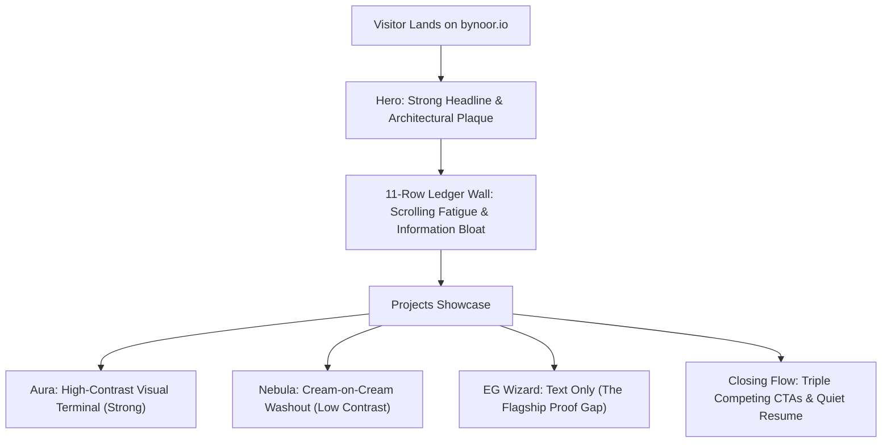

# UI/UX Audit, Strategic Analysis & Action Roadmap

**Target:** `bynoor.io` (Personal Brand & Portfolio of Mohammad Noor Abu Khlaif)  
**Date:** October 9, 2026  
**Focus:** UI/UX, Information Architecture, Visual Proof, Conversion Engineering & Craft  

---

## 1. Executive Summary

`bynoor.io` possesses a distinctive, high-taste foundation: the editorial paper room (`--paper: #f7f3ea`, `--ink: #1b1712`, Fraunces display serif, DM Sans body, pine green accents, and hairlines over heavy shadows) sets it apart from the sea of generic dark-mode, neon-gradient AI websites. Its underlying metrics ($2.87M saved in 15 mins, 0 incidents on 500M+ requests, weeks → hours AI migration platform, 1st AI Champion at Expedia Group, 18.7K YouTube subscribers) provide undeniable career authority.

However, a holistic inspection across desktop and mobile reveals a critical strategic disconnect:

> **The Core Positioning:** *"Architecting AI-native systems that turn weeks of manual engineering into autonomous hours."*  
> **The Visual Reality:** The centerpiece of this claim (**EG Wizard**) has **no visual asset, no architectural schematic, and no interactive proof** — rendered merely as an unadorned text box, situated beneath a dense 11-row wall of text.

Closing this gap between **headline authority** and **visual proof** is the single highest-leverage opportunity for the site.

---

## 2. Comprehensive Ultrathink Analysis: The 5 Core Dimensions

---

### Dimension 1: The AI Proof Gap (Flagship Project: EG Wizard)
* **The Situation:**  
  EG Wizard is Noor's defining career innovation at Expedia Group:
  - Shipped 4 production versions in 6 months.
  - Reduced weeks-long migrations down to hours.
  - Architected a chain-of-tools agent system to eliminate hallucinations.
  - Integrated Model Context Protocol (MCP) servers and agent skills.
  - Adopted as the team's official 3-year strategic roadmap, endorsed by Senior Directors and recognized by SVP.
* **The UI/UX Friction:**  
  Because EG Wizard is internal enterprise software, there is no public URL. Consequently, while Aura has a rich screenshot and Nebula has a site preview, **EG Wizard is displayed as an unillustrated card with plain text and a bare timeline**. Visitors are asked to read dense paragraphs about autonomous agents without any visual or interactive evidence.
* **The Solution:**  
  Build a dedicated **Architectural Blueprint & Agent Workflow Visual** directly into the EG Wizard card:
  - A crisp, styled system schematic: `Developer Prompt / Migration Trigger` → `Agent Orchestrator` → `MCP Server Ecosystem` → `Chain-of-Tools & AST Transform Engine` → `Automated PR & Verification`.
  - Highlight the v1 → v4 architectural milestones with high-contrast badge tokens and velocity metrics (`Weeks → Hours`, `4 Versions in 6 Months`, `Zero-Hallucination Architecture`).

---

### Dimension 2: Cognitive Load & Narrative Pacing (The 11-Row Ledger Wall)
* **The Situation:**  
  Immediately below the hero sits `<dl class="ledger">` containing **11 consecutive full-width rows**.
* **The UI/UX Friction:**  
  - On both desktop and mobile, visitors must scroll through 11 rows of numbers before seeing a single project.
  - Context tags like `at Expedia Group` appear 6 times, and `at Amazon` appears 3 times, creating repetitive clutter.
  - Scannability drops sharply after row 4; scrolling fatigue delays visitors from reaching the portfolio.
* **The Solution:**  
  Re-architect the ledger into an **Elevated Impact Grid**:
  - Feature the top 4 jaw-dropping proof points in prominent headline cards:
    1. **$2.87M Saved in 15 Min** (Expedia Group multi-item checkout hotfix)
    2. **Weeks → Hours Velocity** (EG Wizard AI migration platform)
    3. **0 Incidents / 500M+ Req** (Critical SDK portfolio sole ownership)
    4. **1st AI Champion** (Expedia Group 2024 & 2026 AI pioneer)
  - Provide an elegant, expandable "Complete Career Ledger" toggle (or a compact 2-column tabular index) for the remaining 7 metrics, giving deep researchers access without imposing scroll fatigue on first-time visitors.

---

### Dimension 3: Visual Craft & Media Cohesion (Nebula & Teach Sections)
* **The Situation:**  
  - **Nebula Preview:** The screenshot features a light cream header (`#FAF6EF`). Placed inside a white card on a cream page, it blends into its container and lacks visual depth.
  - **Teach Section:** The YouTube video facades display original thumbnails with saturated cyan and yellow graphics from 2013–2018, clashing with the refined Fraunces and DM Sans typography of the rest of the site.
* **The Solution:**  
  - Wrap the Nebula preview in an editorial **macOS browser viewport** (subtle title bar, window controls, hairline divider) to physically ground the interface.
  - Elevate the Teach cards with refined editorial overlay bezels, structured track metadata badges (`50+ Lectures`, `18.7K Students`, `Arabic-First`), and unified play button interactions.

---

### Dimension 4: Recruiter & Executive Conversion Journey
* **The Situation:**  
  - **Status Pill:** The hero pill displays `Builder · Teacher · Engineer` alongside a pulsing green dot. In modern design patterns, a pulsing dot signals **Availability** (e.g., *Open to select roles*). Using it on a static title misses a key recruiter signal.
  - **Resume Prominence:** Visiting/downloading the PDF resume is one of the top two conversion goals for senior engineering recruiters and hiring managers, yet it is styled as a subdued text link.
  - **Closing Section Flow:** The bottom of the page features three competing actions in rapid succession:
    1. "Book a conversation" (Cal.com CTA in Connect)
    2. "Open the kit" (Prep Kit promo banner)
    3. "Let's build something together" (Cal.com button in the dark green footer)
* **The Solution:**  
  - Update the hero status pill to clearly communicate availability: `Available for Staff/Principal & AI Advisory Roles · Amman / Remote`.
  - Elevate the Resume link into a balanced, high-contrast secondary button in the hero.
  - Streamline the footer sequence so the Prep Kit clearly presents as a free knowledge resource and the footer serves as the definitive conversion anchor.

---

### Dimension 5: Technical Quality & Zero-Defect Hygiene
* **The Situation:**  
  In `src/pages/technical-interview-preparation-kit/index.astro` (line 98), a raw `<link rel="stylesheet" href="/src/styles/resources.css">` is injected inside the head slot.
* **The Defect:**  
  In Astro static production builds, stylesheets are bundled into `/_astro/`, meaning `/src/styles/resources.css` does not exist as a public asset and generates an unnecessary **404 network error** on the live prep kit page.
* **The Solution:**  
  Remove the redundant raw `<link>` tag (the stylesheet is already imported via Astro's ESM pipeline at the top of the component).

---

## 3. Prioritization & Evaluation Matrix

| Rank | Initiative | Impact | Effort | Primary Beneficiary | Strategic Value |
| :---: | :--- | :---: | :---: | :--- | :---: |
| **P0** | **Architectural Blueprint for EG Wizard & Nebula Framing** | **Highest** | Medium | Engineering Leaders & VPs | Bridges the AI proof gap; visually establishes autonomous agent & MCP authority |
| **P1** | **Streamlined Impact Grid & Ledger Pacing** | **Very High** | Low–Medium | All Visitors & Recruiters | Eliminates scrolling fatigue; accelerates path to portfolio projects |
| **P1** | **Hero Availability Signal & Resume Action Elevation** | **High** | Low | Recruiters & Hiring Managers | Directly drives inbound pipeline for senior/staff engineering roles |
| **P2** | **Teach Section Editorial Media Cohesion** | **Medium** | Low | Students & General Audience | Unifies the visual language and elevates the educational masterclass |
| **P2** | **Technical Polish (Prep Kit 404 CSS Link Removal)** | **Medium** | Low | All Visitors / Audits | Enforces zero-error production hygiene |

---

## 4. The Single Most Important Thing to Do NOW

### **Transform the Flagship Portfolio Showcase: Visualizing EG Wizard & Framing Nebula**

#### Why this takes top priority:
1. **Direct Alignment with the Core Thesis:** The site's primary claim is that Noor builds tools that help engineers move faster and architects AI-native systems. When visitors scroll to "What I've Shipped", EG Wizard is the **only project that proves this claim at enterprise scale**. Leaving it without a visual schematic weakens the entire narrative.
2. **Transforming Proprietary IP into an Open Asset:** Because EG Wizard cannot have an external live link, a bespoke architectural diagram (Agent Loop, MCP Servers, Chain-of-Tools, AST Transform) is the only way to deliver concrete proof to senior technical leaders.
3. **Immediate Visual Upgrade:** In a single release, this transforms the centerpiece of the portfolio from an empty white box into an impressive case study, while fixing Nebula's contrast issue at the same time.

---

## 5. Implementation Roadmap

### Phase 1: Flagship Visual Overhaul (Immediate / P0)
- [ ] Design and code the **EG Wizard Architectural Blueprint**:
  - Interactive/styled system flow: Orchestrator Agent → MCP Servers → Chain-of-Tools → PR Generation.
  - Enterprise impact pills: `Weeks → Hours`, `4 Versions in 6 Mo`, `Zero Hallucination`.
- [ ] Add the macOS browser frame to the **Nebula** preview image to restore visual depth.
- [ ] Remove the erroneous `/src/styles/resources.css` 404 `<link>` tag from the Prep Kit page.

### Phase 2: Information Architecture & Ledger Pacing (P1)
- [ ] Extract the Top 4 Proof Points into a prominent **Headline Impact Grid**.
- [ ] Convert the remaining 7 ledger items into an expandable or scannable secondary index.
- [ ] Deduplicate repetitive context labels (`at Expedia Group` / `at Amazon`).

### Phase 3: Recruiter Funnel & Availability Hardening (P1)
- [ ] Update the hero status pill to state current availability (`Available for Staff/Principal & Advisory Roles`).
- [ ] Elevate the Resume link into a primary/secondary button pairing in the hero.
- [ ] Harmonize the closing sequence between Connect, the Prep Kit banner, and the Footer.

### Phase 4: Polish & Refinement (P2)
- [ ] Polish the Teach section video cards with editorial syllabus badges and unified overlays.
- [ ] Audit header navigation spacing on 768px–1024px tablet viewports.
- [ ] Run full Playwright e2e test suite and visual regression checks.
